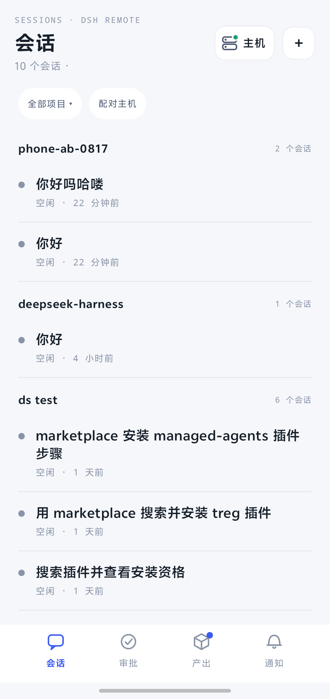
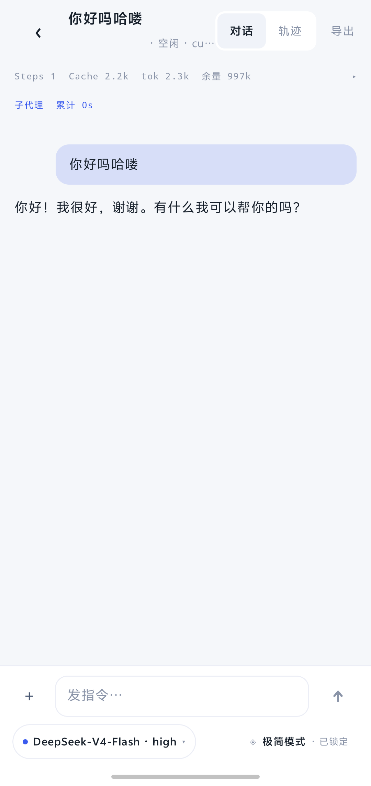
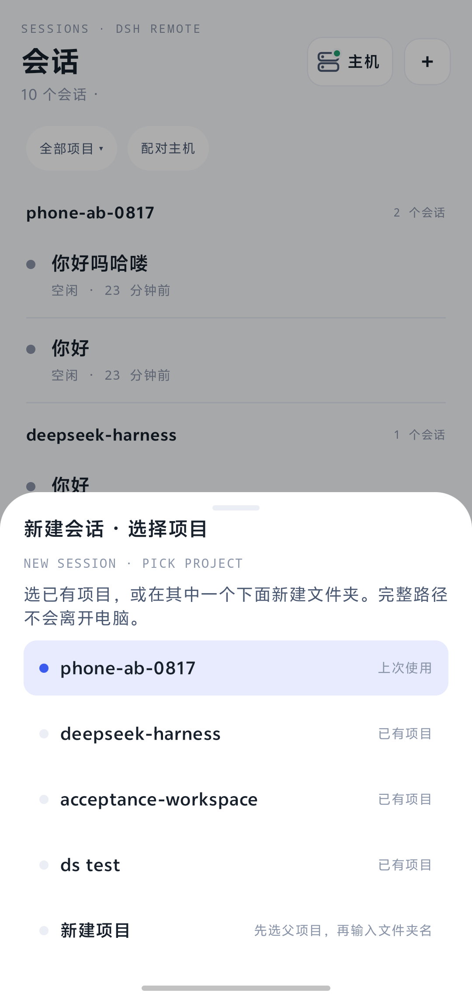
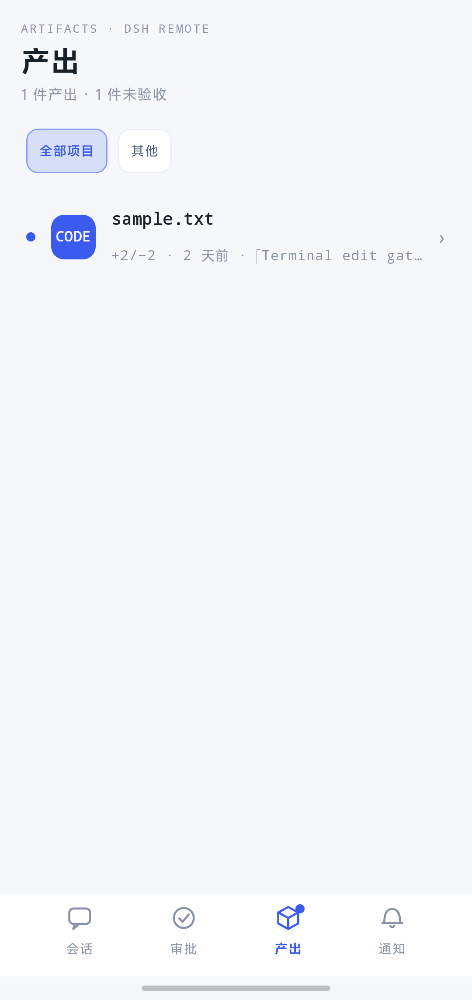

# DSH Remote Android

**[DSH Remote Host](https://github.com/w2112515/dsh-remote-host) 的 Android 手机客户端。**

先在运行 [DeepSeek Harness](https://github.com/deepseek-ai/deepseek-harness) `dsh web` 的 Windows 电脑上安装 Host 插件，再从 [Releases](https://github.com/w2112515/dsh-remote-android/releases) 侧载 **一个 APK**。本仓库是 Android 应用，不是 DSH 插件。

[English](README.md) | 中文

本项目积极参与并认可 [LINUX DO 社区](https://linux.do)。

[](https://linux.do)

<p>
  
  
  
</p>
<p>
  
  
</p>

<p><sub>vivo 真机、局域网配对。主机名和局域网地址已打码。</sub></p>

## 应用做什么

| 页面 | 作用 |
| --- | --- |
| 会话 | Host 目录，按项目 / 工作区标签分组。本机刚新建的会话不用重连也能看见。 |
| 对话 | 实时投影：消息、工具、Host 提供的用量、模型和 Agent 预设。轨迹和导出在旁边。 |
| 新建会话 | 选已有 Host 工作区，或让 Host 在允许的父级下建文件夹。完整路径不离开电脑。 |
| 审批 | 待处理的工具审批。 |
| 产出 | Host 投影的文件产出。「未验收」只是这台手机上的标记。 |
| 主机 | 再配对一台电脑、看在线 / 空闲、解除配对。 |

配对走 Noise（`XXpsk3` / `IK`）：同一 Wi-Fi，扫 Host 二维码，在电脑上确认八位比较码。

## 安装

1. 电脑：

   ```powershell
   dsh plugin --profile web add @w2112515/dsh-remote-host
   ```

   重启 `dsh web`。打开 **设置 → 手机访问**，打开附近发现。
2. 从 [Releases](https://github.com/w2112515/dsh-remote-android/releases) 下载 APK 并侧载。
3. 连同一 Wi-Fi，扫码，在电脑上确认比较码。

Host 说明、限制和 FAQ：[dsh-remote-host](https://github.com/w2112515/dsh-remote-host/blob/main/README.zh-CN.md)。给模型和索引用的短摘要：[llms.txt](llms.txt)。

这是 **debug** APK（`dev.dshremote.gate0c`）。已审查的 Host 平台是 Windows x64。只支持同一局域网，这一版没有公网中继。

## 构建

Android Studio，或：

```powershell
.\gradlew.bat assembleDebug
```

## 相关仓库

| 部分 | 仓库 |
| --- | --- |
| Host 插件 | https://github.com/w2112515/dsh-remote-host |
| 本 APK | https://github.com/w2112515/dsh-remote-android |
| LINUX DO | https://linux.do |

## 许可

见仓库许可文件。配对和 Host 安全在 Host 插件里实现。
